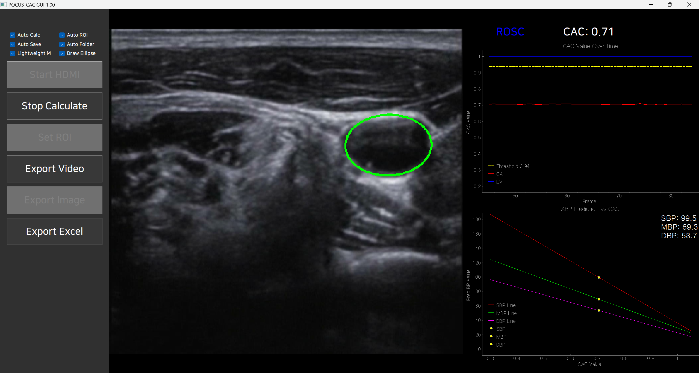

````markdown
# 🚑 ROSC-UI

> **Real-time ROSC Monitoring & Visualization**  
> A lightweight PyQt5 application for on-the-fly visualization of CAC/ABP metrics during CPR.

---



## 🔍 Overview

ROSC-UI captures ultrasound frames (HDMI or video file), runs a TransUNet-based CAC segmentation model, and instantly displays:

- **Compression Amplitude (CAC)** and **IJV compression**  
- **Predicted Arterial Blood Pressure (ABP)** curves  
- **Resuscitation status** (Measuring…, ROSC, Arrest, Invalid)  

All rendered in a sleek dark-themed interface with live graphs and on-screen overlays.

---

## ⚙️ Features

- **Real-time inference** on HDMI input or pre-recorded video  
- **Auto-ROI**, **Auto-Calc**, **Auto-Save** modes for hands-free operation  
- **Lightweight / Full model** toggle for speed vs. accuracy  
- **Ellipse drawing** overlay for vessel contour visualization  
- **CSV / Excel** export of frame-wise measurements  
- **AVI video export** of both raw and annotated streams  

---

## 🚀 Quick Start

1. **Clone & install dependencies**  
   ```bash
   git clone https://github.com/your-org/ROSC-UI.git
   cd ROSC-UI
   pip install -r requirements.txt
````

2. **Run the app**

   ```bash
   python UI_transunet_inference.py
   ```
3. **Connect your ultrasound HDMI** or load a video file, then click **Calculate** to start live analysis.

---

## 📂 Project Structure

```
ROSC-UI/
├── UI_transunet_inference.py   # Main PyQt5 application
├── calculate_CAC.py            # CAC & ABP computation logic
├── model_init.py               # Model loading & transform definitions
├── preprocessing.py            # Image cropping & scaling utilities
├── utils.py                    # Helper functions
├── UI_image/                   # Sample screenshots & diagrams
│   └── Screen_shot.png
├── requirements.txt
└── README.md
```

---

## 📈 Screenshot


---

> Crafted with ❤️ by Subin Park
> [GitHub](https://github.com/your-org/ROSC-UI) • [License](LICENSE)

```
```
